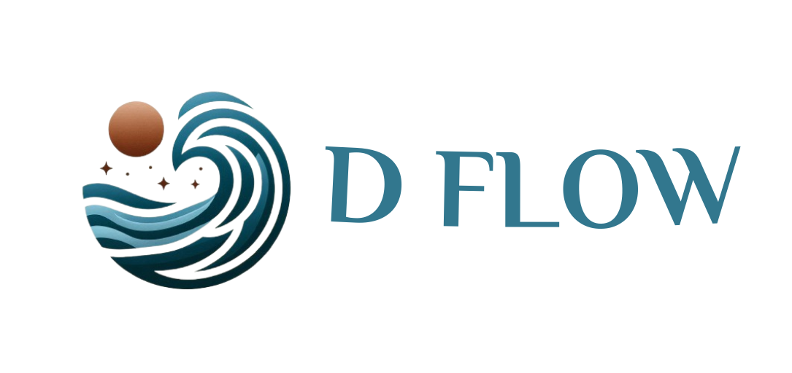

<!-- Improved compatibility of back to top link -->

<a name="readme-top"></a>

<br />
<div align="center">
  <a href="https://github.com/ASEELALOMARI/e-commerce">
    
  </a>

  <h3 align="center">E-Commerce Project</h3>

  <p align="center">
    A feature-rich e-commerce platform for modern online shopping!
    <br />
    <a href="https://d-flow.netlify.app/"><strong>View Demo »</strong></a>
    <br />
    <br/>
</div>

<details>
  <summary>Table of Contents</summary>
  <ol>
    <li><a href="#about-the-project">About The Project</a></li>
    <li><a href="#built-with">Built With</a></li>
    <li><a href="#getting-started">Getting Started</a></li>
    <li><a href="#contact">Contact</a></li>
    <li><a href="#acknowledgments">Acknowledgments</a></li>
  </ol>
</details>

## About The Project

[](https://res.cloudinary.com/dligtpmdv/image/upload/v1732458112/D-flow_ekyfr9.jpg)


This e-commerce platform offers robust functionality to support user-friendly online shopping. It includes features such as product management, customer wishlists, user ratings, and reviews, built using cutting-edge technologies.

### Key Features

- User authentication and role-based access
- Wishlist functionality for personalized shopping
- Reviews and ratings for products
- Fully containerized deployment using Docker

<p align="right">(<a href="#readme-top">back to top</a>)</p>

### Built With

- [][dotnet-url]
- [][ef-url]
- [][React-url]
- [][mui-url]
- [][docker-url]

<p align="right">(<a href="#readme-top">back to top</a>)</p>


## Getting Started

### Prerequisites

Ensure you have the following installed on your system:

- Node.js
  ```sh
  npm install npm@latest -g
  ```
- .NET Core SDK
Download and install the .NET Core SDK from the official website.
[Download .NET Core SDK](https://dotnet.microsoft.com/download/dotnet)


<p align="right">(<a href="#readme-top">back to top</a>)</p> 

## Contact

- ASEEL ALOMARI
- aseelalomari027@gmail.com
- [Project Link](https://github.com/ASEELALOMARI/e-commerce)

<p align="right">(<a href="#readme-top">back to top</a>)</p>

### Acknowledgments

- [Microsoft .NET Documentation](https://learn.microsoft.com/en-us/dotnet/)
- [Entity Framework Documentation](https://learn.microsoft.com/en-us/ef/)
- [Docker Documentation](https://docs.docker.com/)
- [React Documentation](https://reactjs.org/)
- [Material-UI Documentation](https://mui.com/)

<p align="right">(<a href="#readme-top">back to top</a>)</p>

<!-- MARKDOWN LINKS & IMAGES -->
<!-- LINKS -->
[dotnet-url]: https://learn.microsoft.com/en-us/dotnet/
[ef-url]: https://learn.microsoft.com/en-us/ef/
[React-url]: https://reactjs.org/
[mui-url]: https://mui.com/
[docker-url]: https://www.docker.com/
